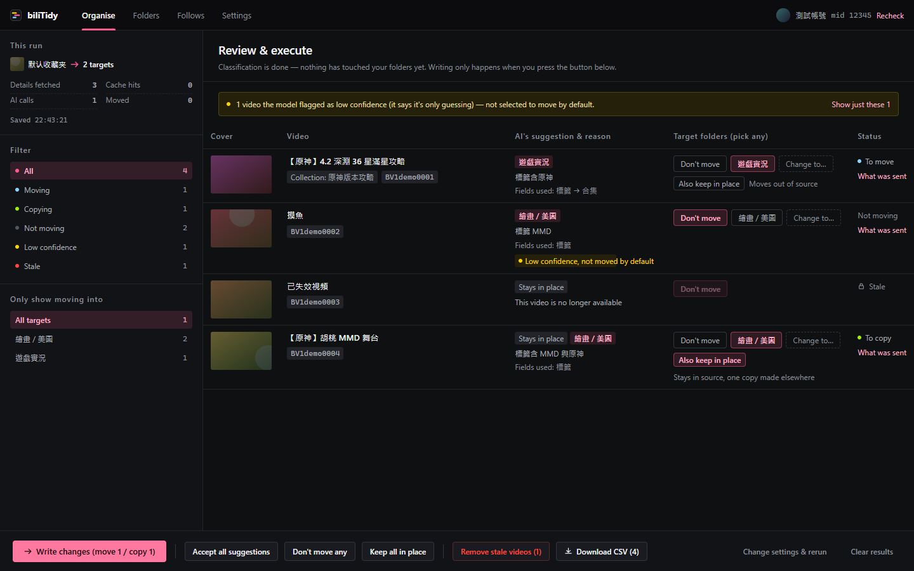
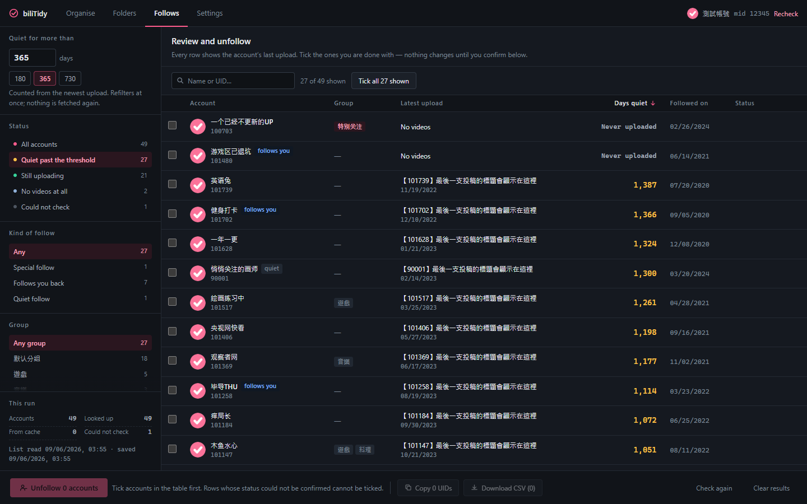

# biliTidy

Tidy your Bilibili account from one Chrome extension: sort favourites into the
right folders with an AI you choose, and unfollow the accounts that stopped
uploading — every change goes through a review table first, and every batch
can be undone.

<p>
  <a href="https://github.com/1morr/biliTidy/actions/workflows/ci.yml"></a>
  <a href="LICENSE"></a>
  
</p>

**English** · [繁體中文](README.zh-Hant.md)

biliTidy is the merge of two sibling extensions by the same author —
biliFavOrg (favourites) and biliFollowCleaner (follows), both earlier private
projects. They
did the same kind of work — read your Bilibili data through the login you
already have, lay it out as a review table with the evidence on every row, let
you tick and confirm, execute in batch, undo — so they now share one toolbar
icon, one settings page, one rate limiter and one look. Nothing moves and
nobody is unfollowed until you press the button.

| Organise favourites | Clean up follows |
|---|---|
|  |  |

## Install

Requires Node.js 20+ and Chrome or Edge 116+.

```bash
npm install
npm run build      # produces .output/chrome-mv3
```

Then `chrome://extensions` → **Developer mode** → **Load unpacked** →
select `.output/chrome-mv3`.

## Getting started

Log in to bilibili.com, then click the extension icon. It opens one tab with
four pages: **Organise**, **Folders**, **Follows**, **Settings**.

### Sort favourites into folders

1. **Settings → 01 AI endpoint** — fill in Base URL, API Key and Model of any
   OpenAI-compatible endpoint, press "Test connection". Only `https://` addresses
   are accepted, plus `http://localhost` and `http://127.0.0.1` for a local model;
   anything else is refused rather than quietly swapped for another endpoint.
   Saving asks for permission to that one origin. (Settings are grouped by who uses them:
   chapters 01–03 only matter for organising favourites, 04–06 are shared;
   the follow clean-up never needs an AI endpoint.)
2. **Folders** — write one sentence per folder describing what belongs in it.
   Type it, import the folder's Bilibili description, or have the AI summarise
   what is already inside; both start as drafts you have to accept.
3. **Organise** — pick a source folder, tick the folders it may move into, run
   the classification, review the table, then execute. **Undo** puts everything
   back in one click.
4. On any video page a ✨ **Smart favourite** button next to the native one
   files the video into the best folder in about a second, with a 10-second
   window to undo or pick manually.

> **Write the descriptions first.** In a measured run, changing one folder's
> description from a bare title like `游戏视频` to an actual sentence took the
> hit rate from 94% to 100%; attaching cover images to every video cost 62 extra
> requests and did *worse*. ([the evaluation](docs/research/classify-eval-2026-08.md))

### Unfollow the accounts that went quiet

1. **Follows** — the first screen tells you how many accounts you follow, how
   many requests the run will take and roughly how long. Press **Read the list
   and check**. One request per account at the read rate in Settings; a couple
   of thousand follows is half an hour at the default 2 req/s. Results are
   cached for 30 days, so the next run only asks about new accounts.
2. On the review table set the threshold (180 / 365 / 730 days, type one, or
   drag the playhead on the timeline column — every row draws the account's
   silence from its latest upload to today), filter by group or kind of
   follow, tick the rows, press **Unfollow N accounts** and confirm. **Undo**
   follows them again and puts them back in their groups.

## How it behaves

Shared by both:

- **Review is the product.** Every row shows the evidence: the AI's suggestion,
  reason and the fields it used; or the account's latest upload, how long ago,
  its groups. Nothing is pre-ticked that the tool is unsure about.
- **Unconfirmed never enters a batch.** Videos that are no longer available are
  never sent for classification; accounts whose upload status could not be
  confirmed (a rate-limited request looks exactly like "never uploaded") are
  shown but cannot be ticked, unfollowed or exported.
- **Rate limiting.** All reads go through one throttled queue (default 2 req/s
  ± 30% jitter; Conservative is 1 req/s), writes are serialised. On `-352` /
  `-412` / `-799` / HTTP 412 the run backs off 60 → 120 → 240 s and then
  **stops, keeping its progress** — rows already fetched are reviewable, the
  rest can be checked later with one click.
- **One long task at a time.** Organising and the follow clean-up share the
  rate limiter, so while one runs the other page's main button is greyed out
  with the reason next to it.
- Runs happen in the extension's own tab, can be cancelled, hold a Web Lock so
  Chrome does not freeze them in the background, and are snapshotted so closing
  the tab keeps the review. Keep the tab in the foreground when you can —
  Chrome clamps background timers to 1 s, which roughly halves the read rate.

Favourites:

- **Staying put is the default.** The prompt starts with where the video
  already lives; with no clearly better home, it stays. A video can live in
  several folders, so the model answers "which folders should this end up in"
  and can suggest keeping it *and* copying it elsewhere ("Also keep in place").
- **Transparent cost.** Settings computes which requests your configuration
  will make; the Organise page recomputes it for the actual number of videos.
- **Deleting a folder is not implemented.** On Bilibili that destroys the videos
  inside it and cannot be undone.
- **Download the run as a CSV** — every row, with what the model suggested next
  to what you chose, its reason and the fields it used.

Follows:

- **Three states, not two.** Every account is *has videos*, *verifiably has
  none*, or **unknown**. Unknown rows stay visible but locked; the next run
  retries them.
- **Groups are a signal.** A follow group (or special follow) usually means you
  filed the account on purpose; filter by group, or "no group" only.
- **Unfollowing is one request per account**, spaced out, with a second
  confirmation in the action bar (Bilibili's batch endpoint only supports
  follow and block). Undo re-follows in batches and restores groups, including
  special follow; quiet follows come back as normal follows.
- **Export** is still there as a fallback: copy the ticked UIDs (comma
  separated, the format the Greasy Fork follow manager imports) or download a
  CSV. Both exclude unknown accounts.

## Permissions

| Permission | Why |
|---|---|
| `host_permissions` | `api.bilibili.com` (API), `www.bilibili.com` (cookie and the video-page button), `*.hdslb.com` (covers and subtitles) |
| `optional_host_permissions` | Requested only for the AI origin you enter, when you save it. Cleartext HTTP is allowed only for `localhost` |
| `content_scripts` | Only on `www.bilibili.com/video/*`, to add the ✨ button. It makes no requests itself |
| `cookies` | Reads `bili_jct` for the CSRF token on writes (moves, unfollows, follow-agains) |
| `declarativeNetRequestWithHostAccess` | Adds `Referer`/`Origin` to the extension's own calls to `api.bilibili.com` — the follow-list endpoint returns an empty list without them |
| `storage`, `unlimitedStorage` | Settings, descriptions, run snapshots, the IndexedDB caches |

Your API key is stored in `chrome.storage.local`, is never written to a log, a
snapshot, or an export, and is only ever sent to the origin you configured.
Everything else stays in this browser; the only Bilibili host it talks to is
`api.bilibili.com` (plus `hdslb.com` for cover thumbnails and subtitles).

## Development

| Command | |
|---|---|
| `npm run dev` | WXT dev mode with HMR |
| `npm run build` / `npm run zip` | Build / package |
| `npm run typecheck` / `npm test` / `npm run lint` | `tsc --noEmit` / vitest / oxlint |
| `npm run ui-preview` | Runs all four pages against mocked Bilibili and AI endpoints — a whole classification, a whole follow clean-up, the mutual-exclusion state, settings, Traditional Chinese — and screenshots every screen. No account, no API key, no network. |
| `npm run quickfav-preview` | Same trick for the video page: feeds a fake video page to the real content script and screenshots the smart-favourite toasts |
| `npm run smoke` | Playwright loads the built extension and walks the settings page |
| `npm run gen-icons` | Regenerates `public/icon/*.png` from `icon.svg` (renders the SVG in Playwright's Chromium) |

The last four commands drive Playwright's own Chromium — run `npx playwright install chromium` once before the first of them.

`.env.example` is only for manual test scripts. **The extension never reads it** —
the real Base URL and API key are entered in Settings.

## Documentation

The in-depth docs are written in Traditional Chinese.

| | |
|---|---|
| [docs/how-it-works.md](docs/how-it-works.md) | What each button does and what every setting changes |
| [docs/design.md](docs/design.md) | Why it is built this way, and the Bilibili API findings behind it |
| [docs/research/](docs/research/) | The measurements quoted above |
| [PRODUCT.md](PRODUCT.md) / [DESIGN.md](DESIGN.md) | Who it is for and what must not change / the visual system |
| [CHANGELOG.md](CHANGELOG.md) | What changed |

Merged from the author's earlier private extensions biliFavOrg and
biliFollowCleaner — this repository is where their combined history continues.

## License

[MIT](LICENSE)
